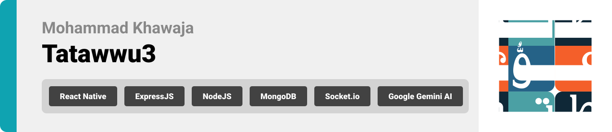
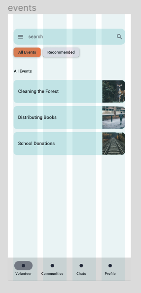
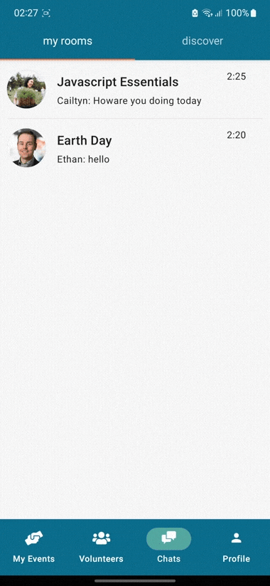

<br><br>

<!-- project philosophy -->


> A mobile app for finding volunteering oppurtunities based on skills, making it easier for volunteers and communities/organizations to connect.
>
> Tatawwu3 aims to simplify the process of volunteering by providing a user-friendly platform for volunteers to apply for opputunities, and for communities/organizations to find suitable volunteers.

### User Stories

  <h4>As a Volunteer:</h4>
  <ul>
  <li>I want to be able to create my profile by uploading nessesary documents, so that I don't waste time on manually creating my profile.</li>
  <li>I want to be able to find oppurtunities based on my skill/experience, so that I can help with what I'm best at.</li>
    <li>I want to be able to chat with other volunteers in chat rooms, so that I can stay connected with people with similar interests.</li>
</ul>

<h4>As an Organization:</h4>
<ul>
  <li>I want to be able to find volunteers efficiently, so that I can make sure my events run smoothly on time.</li>
  <li>I want to be able to add events and manage applicants, so that I can organize my events precisely.</li>
  <li>I want to be able to create chat rooms for my volunteers, so that I can leave a good impact on youth.</li>
</ul>
<h4>As an Admin:</h4>
<ul>
  <li>I want to be able to approve or deny users registering for the app, so that I can verify their identities.</li>
  <li>I want to be able to monitor general information on a dashboard, so that I can keep track of app.
</li>
</ul>
<br><br>

<!-- Tech stack -->


### Tatawwu3 is built using the following technologies:

- This project uses [React](https://react.dev/) for the admin dashboard. React is a JavaScript library for building user interfaces, it is used to build single-page applications, and it allows us to create reusable UI components.
- This project uses [React Native](https://reactnative.dev/) with [Expo](https://expo.dev/) for the frontend. React Native is a cross-platform hybrid app development platform which allows us to use a single codebase for apps on mobile, desktop, and the web.
- For persistent storage (database), the app uses [MongoDB Atlas](https://www.mongodb.com/) which is a fully-managed cloud database that handles all the complexity of deploying, managing, and healing our deployments on the cloud.
- As a backend, the app uses [Node.js](https://nodejs.org/en) with [Express.js](https://nodejs.org/en), Express JS is a small framework that works on top of Node web server functionality to simplify its APIs and add helpful new features. It makes it easier to organize your application’s functionality with middleware and routing.
- The app uses [Socket.io](https://socket.io/) for real time chats, Socket.IO is an event-driven library for real-time web applications. It enables real-time, bi-directional communication between web clients and servers. 
- The app also relies heavily on [Google Gemini AI](https://ai.google.dev/docs) which is Google's largest and most capable AI model, in our app it is used to:
  <ul><li>Analyze every user's resume and return specific data based on prompt engineering</li> 
  <li>Recommend events for volunteers using vector embeddings</li> 
  <li>Allow users to search semantically over events or volunteers, based on skills or targeted skills using vector embeddings</li> </ul>
<br><br>

<!-- UI UX -->


> We designed Tatawwu3 using wireframes and mockups, iterating on the design until we reached the ideal layout for easy navigation and a seamless user experience.
> 
### Mockups:

| Splash screen                              | Login Screen            | Home screen               | Communities Screen               |
| ----------------------------------------- | --------------------------------------- | --------------------------------------- | --------------------------------------- |
|  |  | ||


- Project Figma design [figma](https://www.figma.com/file/7X4q4csvnqkHpUb2iipfej/Tatawwu3?type=design&node-id=20%3A3220&mode=design&t=ZlyIql4yj3VNkuNU-1)
  


### Database Design:


<br><br>

<!-- Implementation -->


### User Screens (Mobile)


| Login screen                              | Extract CV Data (Gemini AI)             | Home screen (Volunteer)               | Search for Events (Semantically)                |
| ----------------------------------------- | --------------------------------------- | --------------------------------------- | --------------------------------------- |
|  |  | ||

|  Home screen (Community)      | Communities screen                      | Chats screen                          | Profile screen              |
| ----------------------------------------- | --------------------------------------- | --------------------------------------- | --------------------------------------- |
| |  | ||


https://github.com/MohammadKhaweja/tatawwu3/assets/79599293/def04a75-731c-4527-b6b1-8a0c5730de8d

### Admin Screens (Web)

| Login screen                            | Landing screen                     | 
| --------------------------------------- | ------------------------------------- |
|  |  | 


<br><br>

<!-- Prompt Engineering -->


- Prompt engineering (with Google Generative AI) was used to generate a user biograpghy based on his resume, extract and return user skills and academic history.
  
#### Example:

>`pretend that you are a machine that analyzes people by only reading their CVs, you never generate something you don't know about them, I will provide you with a text of my CV, try to make a small (bio) about me , and extract the most important skills (skills should be titles or words )and extract academic history, return only a json object like this without any surrounding data {bio:{String},academicHistory:[{degreeTitle:String, Institution:String}],skills:[]}, keep in mind that skills are so important, be non biased: ${extracted}`
>

<br><br>

<!-- AWS Deployment -->


- This project was deployed on an AWS ec2 instance, an example code of how it was deployed:
    ```sh
    sudo yum install -y gcc-c++ make
    curl -sL https://rpm.nodesource.com/setup_21.x | sudo -E bash -
    sudo yum install -y nodejs
    sudo yum install -y git
    sudo vim /etc/systemd/system/tatawwu3.service
  	    [Unit]
      	Description=tatawwu3
      	After=multi-user.target

      	[Service]
      	ExecStart=/usr/bin/node /home/ec2-user/tatawu3/backend/index.js
      	Restart=always
      	RestartSec=10
        StandardOutput=syslog
      	StandardError=syslog
      	SyslogIdentifier=tatawwu3
      	User=ec2-user
      	EnvironmentFile=/home/ec2-user/tatawwu3/backend/.env

	      [Install]
	      WantedBy=multi-user.target

   sudo systemctl enable tatawwu3
   sudo systemctl start tatawwu3
    ```
- optional nginx reverse proxy
     ```sh
     sudo amazon-linux-extras install nginx1 -y
     sudo systemctl enable nginx
     sudo systemctl start nginx
     sudo vim /etc/nginx/nginx.conf
     location / {
          proxy_pass http://localhost:8080;
         }
     sudo systemctl restart nginx
   ```
<br><br>

<!-- Unit Testing -->


### Unit Testing:

- This project uses Jest and SuperTest to test its APIs, here's an example of how a test result would look like


<br><br>

<!-- How to run -->


> To set up Tatawwu3 locally, follow these steps:

### Prerequisites

- Install NPM from: [NPM](https://nodejs.org/en/download)
- Install nodemon
   ```sh
   npm install nodemon
   ```
## Installation

### First, Cloning and Installing Packages

1. Clone the repository and then open it
   ```sh
   git clone https://github.com/MohammadKhaweja/tatawwu3.git
   cd backend 
   ```
2. Create a .env file in backend and then:
   1. Create a [Google Gemini AI](https://ai.google.dev/docs) API Key 
   2. Create an Gmail account and then an [App Password](https://support.google.com/mail/answer/185833?hl=en)
   3. Create a [MongoDB Atlas](https://www.mongodb.com/) Cluster 
   After that add them to the env file as follows:

    ```sh
    JWT_SECRET=yourSecret
    MONGODB_URL=yourClusterConnection
    GMAIL='yourGmail@gmail.com'
    PASSWORD='password'
    GEMINI_API='yourApi'

    ```
    4. cd frontend and go to store/user
       
    ```sh
    export const BASE_URL = "yuorLocalHost";

    ```
  
3. Install NPM packages for Backend, Frontend and Admin:
   ```sh
   cd backend
   npm install
   cd ..
   cd frontend
   npm install
   cd ..
   cd admin
   npm install
   ```

### Second, let's start the server

 In `backend` run this command:
   ```sh
   nodemon 
   ```
### Third, let's start the frontend

 Open a new terminal and go to `frontend` and run this command:
   ```sh
   npx expo start 
   ```
### Lastly, let's start the Admin Dasboard
 Open a new terminal and go to `admin` and run this command:
   ```sh
   npm run dev 
   ```

Now, you should be able to run Tatawwu3 locally and explore its features.
